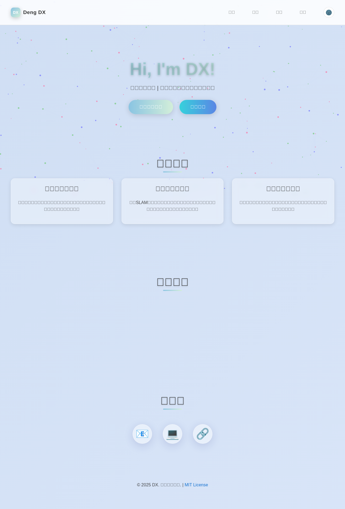
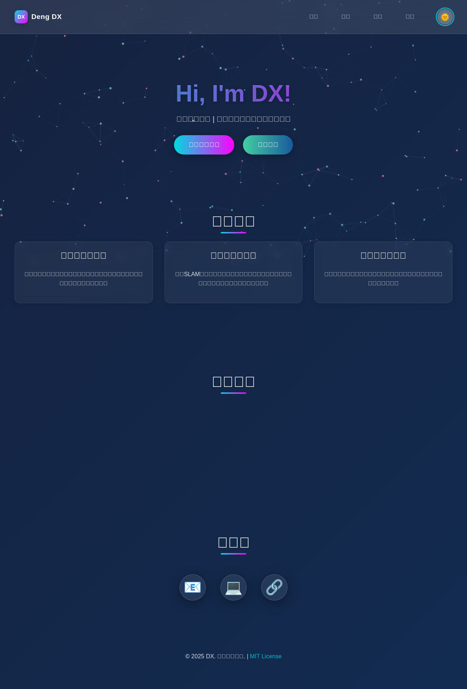
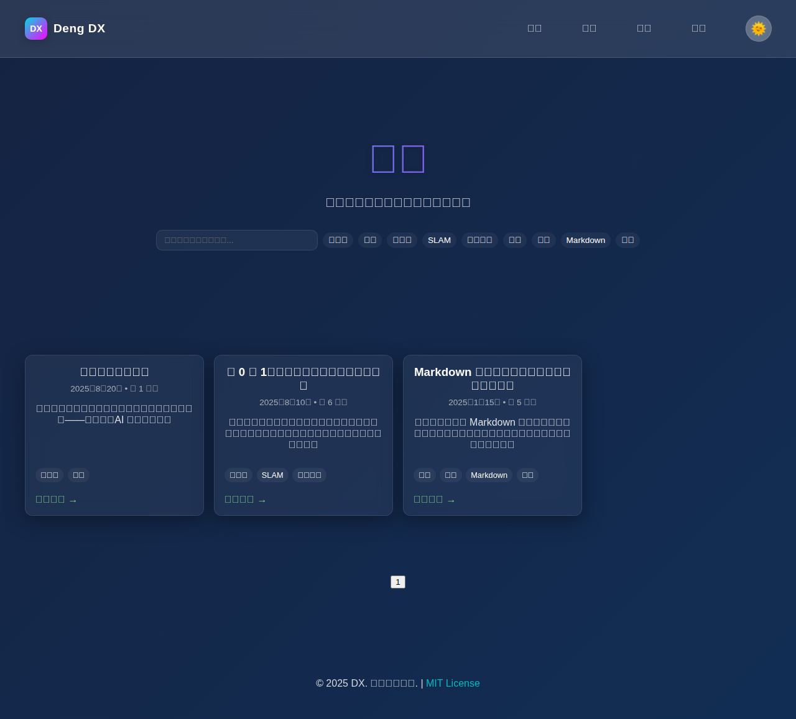
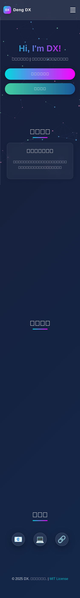

# DX 的个人主页 🤖


---


## ✨ 预览

### 🌙 深色主题
<div align="center">
  

### ☀️ 浅色主题
<div align="center">
  
</div>

### 📝 博客系统
<div align="center">
  
</div>

### 📱 移动端适配
<div align="center">
  
</div>

## 🚀 特性

### 🏠 主页功能
- ✅ **响应式设计** - 完美适配桌面、平板、手机等各种设备
- 🌓 **主题切换** - 支持深色/浅色主题，提供舒适的阅读体验
- 🎯 **项目展示** - 展示个人项目作品，包含详细描述
- 💼 **技能展示** - 专业技能和技术栈的可视化展示
- 📧 **联系方式** - 多种联系方式，方便沟通交流
- ✨ **动画效果** - 流畅的页面动画和交互效果
- 🎨 **玻璃拟态设计** - 现代化的视觉设计风格

### 📖 博客系统
- 📚 **文章管理** - 完整的文章列表、搜索和筛选功能
- 🏷️ **标签系统** - 支持多标签分类，便于内容组织
- 📝 **Markdown 支持** - 完整的 Markdown 语法支持，包括数学公式
- ⚡ **实时预览** - 文章创建时的实时预览功能
- 🔒 **权限控制** - 管理功能的密码保护机制
- 📄 **分页系统** - 优化大量文章的浏览体验
- 🔍 **全文搜索** - 支持按标题、内容、标签搜索

### 🔧 技术特性
- 🚀 **纯前端** - 无需后端服务，基于静态文件部署
- 💾 **本地存储** - 利用 localStorage 保存用户创建的内容
- 📱 **PWA 就绪** - 支持离线访问和移动端安装
- ⚡ **性能优化** - 懒加载、代码分割、资源压缩
- 🌐 **SEO 友好** - 完整的 meta 标签和语义化 HTML

## 🛠️ 技术栈

| 类别 | 技术 | 版本 | 说明 |
|------|------|------|------|
| **前端框架** | 原生 JavaScript | ES6+ | 无框架依赖，轻量高效 |
| **样式** | CSS3 | - | 包含动画、渐变、网格布局 |
| **标记语言** | HTML5 | - | 语义化标签，无障碍访问 |
| **Markdown 解析** | [marked.js](https://github.com/markedjs/marked) | 最新版 | Markdown 到 HTML 转换 |
| **数学公式** | MathJax | 3.x | LaTeX 数学公式渲染 |
| **部署** | GitHub Pages | - | 自动化部署和 CI/CD |
| **版本控制** | Git | - | 代码版本管理 |

## 📁 项目结构

```
📁 Dengdxx.github.io/
├── 📄 index.html              # 🏠 主页 - 个人简介和项目展示
├── 📄 blog.html               # 📝 博客列表页 - 文章索引和搜索
├── 📄 post.html               # 📖 文章详情页 - 单篇文章展示
├── 📄 404.html                # ❌ 404 页面 - 自定义错误页
├── 📄 CNAME                   # 🌐 域名配置文件
├── 📄 LICENSE                 # 📜 MIT 开源协议
├── 📄 package.json            # 📦 项目配置文件
├── 📁 assets/                 # 📂 静态资源目录
│   ├── 📁 css/               # 🎨 样式文件
│   │   ├── style.css         # 主页样式（响应式 + 主题）
│   │   └── blog.css          # 博客样式（文章渲染 + 交互）
│   ├── 📁 js/                # ⚙️ JavaScript 脚本
│   │   ├── script.js         # 主页交互脚本
│   │   ├── blog.js           # 博客系统核心逻辑
│   │   └── particles.js      # 背景粒子特效
│   └── 📁 data/              # 🗃️ 数据文件
│       └── posts.json        # 博客文章数据存储
├── 📁 docs/                  # 📚 文档目录
│   └── 📁 images/           # 🖼️ README 图片资源
└── 📄 README.md              # 📖 项目说明文档
```

### 🗂️ 关键文件说明

| 文件/目录 | 功能描述 | 技术要点 |
|----------|----------|----------|
| `index.html` | 个人主页入口 | 响应式布局、SEO优化 |
| `blog.html` | 博客系统主界面 | 动态内容渲染、搜索筛选 |
| `assets/css/` | 样式表集合 | CSS Grid、Flexbox、动画 |
| `assets/js/` | 前端逻辑 | ES6+、模块化、异步处理 |
| `assets/data/` | 数据存储 | JSON格式、本地存储集成 |

## 📝 博客系统

博客系统是本项目的核心功能之一，采用完全前端实现的静态博客架构。

### ✨ 核心特性

#### 📚 文章管理
- **双重存储**：预设文章存储在 `assets/data/posts.json`，用户创建的文章保存在 localStorage
- **完整生命周期**：支持文章的创建、编辑、查看、删除等完整操作
- **批量操作**：支持多选删除、批量标签管理

#### 🔍 搜索与筛选
```javascript
// 支持多种搜索方式
- 标题搜索：直接输入文章标题关键词
- 内容搜索：搜索文章正文内容
- 标签筛选：点击标签快速筛选相关文章
- 组合搜索：标题 + 标签的组合筛选
```

#### 📝 Markdown 编辑器
- **实时预览**：左侧编辑，右侧实时预览效果
- **语法支持**：完整的 Markdown 语法支持
- **数学公式**：集成 MathJax，支持 LaTeX 数学公式
- **代码高亮**：支持多种编程语言的语法高亮
- **单元格结构**：类似 Jupyter Notebook 的单元格编辑方式

#### 🔒 权限控制
```
管理员密码：qweasd123
```
- 文章删除需要密码验证
- 管理功能的访问控制
- 防误删机制

### 🛠️ 技术实现

#### 数据存储策略
```json
{
  "posts": [
    {
      "id": "unique-post-id",
      "title": "文章标题",
      "content": "Markdown 内容",
      "date": "2025-01-15",
      "tags": ["标签1", "标签2"],
      "readTime": "约 5 分钟"
    }
  ]
}
```

#### 核心功能模块
- **`blog.js`**：博客系统核心逻辑
- **`posts.json`**：预设文章数据
- **`marked.js`**：Markdown 解析引擎
- **`MathJax`**：数学公式渲染

#### API 设计
```javascript
// 主要功能函数
loadPosts()          // 加载文章列表
searchPosts(query)   // 搜索文章
filterByTag(tag)     // 按标签筛选
createPost(data)     // 创建新文章
deletePost(id)       // 删除文章
renderMarkdown(md)   // 渲染 Markdown
```

### 🎯 使用指南

#### 创建文章
1. 访问博客页面 → 点击"创建文章"按钮
2. 填写文章标题和标签
3. 在单元格中编辑内容（支持 Markdown）
4. 实时预览效果
5. 保存发布

#### 管理文章
1. 输入管理密码 `qweasd123` 进入管理模式
2. 可以删除不需要的文章
3. 可以编辑现有文章内容

#### 搜索技巧
- 直接输入关键词：搜索标题和内容
- 点击标签：快速筛选该标签的所有文章
- 组合使用：先选择标签，再输入关键词搜索

### 🔄 数据迁移

如需将文章从其他平台迁移到本博客系统：

1. 准备 JSON 格式的文章数据
2. 将数据添加到 `assets/data/posts.json`
3. 确保数据格式符合上述 schema
4. 刷新页面查看迁移结果

## 💻 本地运行

### 🚀 快速开始

由于是纯静态网站，您可以选择以下任一方式运行：

#### 方法 1：直接打开（最简单）
```bash
# 克隆仓库
git clone https://github.com/Dengdxx/Dengdxx.github.io.git

# 进入项目目录
cd Dengdxx.github.io

# 直接在浏览器中打开 index.html
open index.html  # macOS
# 或双击 index.html 文件
```

#### 方法 2：使用 Python 服务器（推荐）
```bash
# Python 3.x
python -m http.server 8000

# Python 2.x
python -m SimpleHTTPServer 8000

# 访问 http://localhost:8000
```

#### 方法 3：使用 Node.js 服务器
```bash
# 安装 http-server（一次性）
npm install -g http-server

# 启动服务器
npx http-server

# 或者使用 serve
npm install -g serve
serve .
```

#### 方法 4：使用其他工具
```bash
# 使用 PHP (如果已安装)
php -S localhost:8000

# 使用 Ruby (如果已安装)
ruby -run -e httpd . -p 8000

# 使用 Live Server (VS Code 扩展)
# 安装 Live Server 插件，右键选择 "Open with Live Server"
```

### 🔧 开发环境设置

如果您想参与开发，推荐以下配置：

```bash
# 1. 克隆仓库
git clone https://github.com/Dengdxx/Dengdxx.github.io.git
cd Dengdxx.github.io

# 2. 启动开发服务器（带热重载）
# 使用 Python
python -m http.server 8000 &

# 3. 在浏览器中访问
open http://localhost:8000

# 4. 开始开发！
```

### 📋 系统要求

- **浏览器**: Chrome 60+, Firefox 55+, Safari 12+, Edge 79+
- **开发工具**: 任意代码编辑器（推荐 VS Code）
- **本地服务器**: Python 3.x / Node.js 14+ / PHP 7+ （可选）

### ⚡ 性能优化

为了获得最佳性能体验：

1. **使用 HTTPS**: 部署时启用 HTTPS（GitHub Pages 自动支持）
2. **启用压缩**: 生产环境建议启用 Gzip 压缩
3. **CDN 加速**: 可以考虑使用 CDN 加速静态资源
4. **缓存策略**: 合理设置浏览器缓存策略

## 🎨 主题系统

网站支持深色和浅色两套主题，提供舒适的阅读体验。

### 🌓 主题特性

| 主题 | 适用场景 | 视觉特点 |
|------|----------|----------|
| 🌙 **深色主题** | 夜间阅读、护眼 | 深色背景、柔和光线 |
| ☀️ **浅色主题** | 白天使用、打印友好 | 明亮背景、清晰对比 |

### 🎨 设计语言

- **玻璃拟态 (Glassmorphism)**：半透明背景 + 模糊效果
- **渐变色彩**：多层次渐变，营造深度感
- **流畅动画**：CSS3 动画增强用户体验
- **响应式图标**：emoji + SVG 图标组合

### 💡 主题切换

用户可以通过以下方式切换主题：
- 点击导航栏的主题切换按钮（🌚/🌞）
- 系统会自动记住用户的主题偏好
- 支持系统主题自动跟随（计划功能）

## 📱 响应式设计

网站采用移动优先的响应式设计策略，确保在各种设备上都有良好的用户体验。

### 📐 断点设计

| 设备类型 | 屏幕尺寸 | 布局特点 |
|----------|----------|----------|
| 📱 **手机** | < 768px | 单列布局、大按钮、堆叠式导航 |
| 📟 **平板** | 768px - 1024px | 双列布局、适中的元素间距 |
| 💻 **桌面** | > 1024px | 多列网格、丰富的交互效果 |

### 🎯 移动端优化

- **触摸友好**：按钮大小符合手指点击习惯
- **滑动导航**：移动端汉堡菜单，支持手势操作
- **快速加载**：图片懒加载、CSS/JS 压缩
- **离线访问**：PWA 特性，支持离线浏览

### 🔧 兼容性测试

已在以下设备和浏览器中测试通过：

| 类别 | 支持情况 |
|------|----------|
| **桌面浏览器** | Chrome 60+, Firefox 55+, Safari 12+, Edge 79+ |
| **移动浏览器** | iOS Safari 12+, Chrome Mobile 60+, Samsung Internet |
| **屏幕分辨率** | 320px ~ 4K (3840px) |
| **操作系统** | Windows, macOS, Linux, iOS, Android |

## 🚀 部署

### 🔄 自动部署 (GitHub Pages)

项目使用 GitHub Pages 进行自动化部署：

```bash
# 1. Fork 或 Clone 项目
git clone https://github.com/Dengdxx/Dengdxx.github.io.git

# 2. 修改内容后推送到 main 分支
git add .
git commit -m "更新网站内容"
git push origin main

# 3. GitHub Pages 会自动部署
# 访问 https://your-username.github.io 查看效果
```

### 🏗️ 部署配置

1. **仓库设置**：
   - 仓库名必须是 `username.github.io` 格式
   - 在 Settings → Pages 中选择 source 为 `main` 分支

2. **自定义域名**（可选）：
   ```bash
   # 在 CNAME 文件中添加域名
   echo "your-domain.com" > CNAME
   ```

3. **SSL 证书**：
   - GitHub Pages 自动提供免费 SSL 证书
   - 支持 HTTPS 访问

### 🌐 其他部署方式

#### Vercel 部署
```bash
# 1. 安装 Vercel CLI
npm i -g vercel

# 2. 在项目根目录执行
vercel

# 3. 按提示完成配置
```

#### Netlify 部署
```bash
# 1. 连接 GitHub 仓库到 Netlify
# 2. 设置构建命令（留空，因为是静态文件）
# 3. 设置发布目录为 "." 
```

#### 传统服务器部署
```bash
# 上传所有文件到 web 服务器根目录
# 确保支持 HTML5 History API（如果需要）
# 配置 HTTPS 和 Gzip 压缩
```

### 🔧 部署优化

#### 性能优化
```nginx
# Nginx 配置示例
server {
    listen 443 ssl http2;
    server_name your-domain.com;
    
    # 启用 Gzip 压缩
    gzip on;
    gzip_types text/css application/javascript;
    
    # 设置缓存
    location ~* \.(css|js|png|jpg|jpeg|gif|ico|svg)$ {
        expires 1y;
        add_header Cache-Control "public, no-transform";
    }
}
```

#### CDN 加速
```html
<!-- 在 HTML 中使用 CDN 链接 -->
<link rel="dns-prefetch" href="//cdn.jsdelivr.net">
<script src="https://cdn.jsdelivr.net/npm/marked/marked.min.js"></script>
```

## 🤝 贡献

欢迎参与项目改进！以下是参与贡献的步骤：

### 🛠️ 开发流程

1. **Fork 项目**
   ```bash
   # 点击页面右上角的 Fork 按钮
   git clone https://github.com/your-username/Dengdxx.github.io.git
   ```

2. **创建特性分支**
   ```bash
   git checkout -b feature/your-feature-name
   ```

3. **开发和测试**
   ```bash
   # 启动本地服务器
   python -m http.server 8000
   
   # 在浏览器中测试功能
   open http://localhost:8000
   ```

4. **提交更改**
   ```bash
   git add .
   git commit -m "feat: 添加新功能描述"
   ```

5. **推送并创建 PR**
   ```bash
   git push origin feature/your-feature-name
   # 在 GitHub 上创建 Pull Request
   ```

### 📋 贡献指南

#### 代码规范
- **HTML**: 使用语义化标签，保持良好的结构
- **CSS**: 遵循 BEM 命名规范，使用 CSS 自定义属性
- **JavaScript**: 使用 ES6+ 语法，保持代码简洁
- **提交信息**: 使用 Conventional Commits 规范

#### 功能建议
以下功能欢迎贡献：

- [ ] 📊 **数据统计**: 文章阅读量、标签统计
- [ ] 🔍 **高级搜索**: 正则表达式、日期范围搜索
- [ ] 📤 **导入导出**: 支持 Markdown 文件批量导入
- [ ] 🌍 **国际化**: 多语言支持
- [ ] 📱 **PWA 增强**: 离线缓存、通知推送
- [ ] 🎨 **主题定制**: 用户自定义主题色彩
- [ ] 💬 **评论系统**: 集成第三方评论服务

#### 问题反馈
- 🐛 **Bug 报告**: 使用 GitHub Issues，提供详细的重现步骤
- 💡 **功能请求**: 描述需求和使用场景
- 📝 **文档改进**: 发现文档错误或不完整的地方

### 🏆 贡献者

感谢所有为项目做出贡献的开发者！

<!-- 这里可以添加贡献者列表 -->
[](https://github.com/Dengdxx/Dengdxx.github.io/graphs/contributors)

## 📄 许可证

本项目使用 [MIT 许可证](LICENSE) 开源。

```
MIT License

Copyright (c) 2025 Deng DX

Permission is hereby granted, free of charge, to any person obtaining a copy
of this software and associated documentation files (the "Software"), to deal
in the Software without restriction, including without limitation the rights
to use, copy, modify, merge, publish, distribute, sublicense, and/or sell
copies of the Software, and to permit persons to whom the Software is
furnished to do so, subject to the following conditions:

[完整许可证文本请查看 LICENSE 文件]
```

### 🔓 使用权限

✅ **允许的使用**：
- 个人和商业使用
- 修改和分发
- 私人使用
- 创建衍生作品

❗ **注意事项**：
- 保留版权声明
- 提供许可证副本
- 声明更改内容

## 📞 联系方式

### 👨‍💻 作者信息

**Deng DX** - 机器人开发者
- 🎓 专业背景：机器人技术、人工智能
- 🔬 研究方向：SLAM、路径规划、深度学习
- 💼 技术栈：Python, C++, ROS, TensorFlow

### 📬 联系方式

| 平台 | 链接 | 用途 |
|------|------|------|
| 📧 **邮箱** | [dengdx@tju.edu.cn](mailto:dengdx@tju.edu.cn) | 正式沟通、合作咨询 |
| 💻 **GitHub** | [https://github.com/Dengdxx](https://github.com/Dengdxx) | 代码交流、项目合作 |
| 🔗 **LinkedIn** | [个人 LinkedIn](https://linkedin.com) | 职业网络、学术交流 |
| 🏠 **个人网站** | [https://dengdxx.github.io/](https://dengdxx.github.io/) | 作品展示、博客文章 |

### 💬 交流内容

欢迎就以下话题进行交流：
- 🤖 机器人技术和算法讨论
- 🧠 人工智能和机器学习
- 💻 开源项目合作
- 🎓 学术研究和论文交流
- 🛠️ 技术问题和解决方案

---

<div align="center">
  <h3>🌟 如果这个项目对您有帮助，请给个 Star！ 🌟</h3>
  <p>感谢您的关注和支持！</p>
  
  
  
  
</div>
